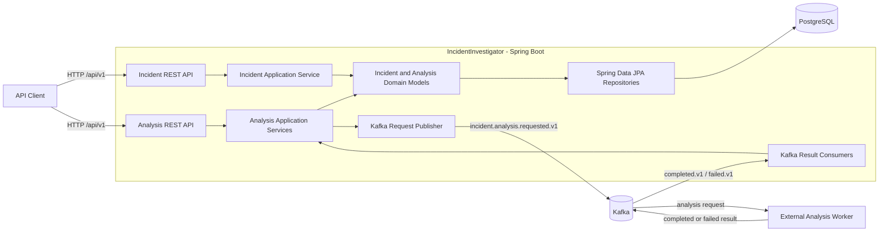
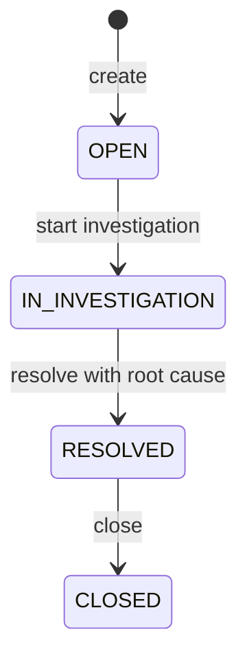

# IncidentInvestigator

IncidentInvestigator is a Spring Boot service for managing operational incidents, collecting investigation evidence, and coordinating asynchronous root-cause analysis over Kafka.

## Architecture

The application is a modular monolith organized around two business modules:

- `incident` owns the incident lifecycle, evidence, and root cause.
- `analysis` coordinates Kafka messages, execution history, retries, and result persistence.



The asynchronous analysis worker is an integration boundary; its implementation is not part of this repository.

### Package Structure

```text
com.CemHarput.IncidentInvestigator
|-- incident
|   |-- api              # REST controllers and request/response records
|   |-- application      # Transactional incident use cases
|   |-- domain           # Incident, Evidence, RootCause, lifecycle rules
|   |-- exception
|   `-- infrastructure   # Spring Data repository
|-- analysis
|   |-- api              # Analysis endpoints and response records
|   |-- application      # Analysis orchestration and result evaluation
|   |-- client           # Benchmark-only synchronous analyzer adapter
|   |-- domain           # AnalysisExecution state and failure model
|   |-- dto
|   |-- exception
|   |-- infrastructure   # Analysis execution repository
|   `-- messaging        # Kafka publisher, consumers, and event contracts
|-- common.exception     # API error model and global exception mapping
`-- config               # HTTP client and Kafka consumer configuration
```

### Incident Lifecycle



The domain model enforces these rules:

- Evidence (`LOG`, `METRIC`, or `TRACE`) can only be added during `IN_INVESTIGATION`.
- A root cause can only be attached during `IN_INVESTIGATION`.
- A confirmed root cause cannot be overwritten.
- Resolution requires an existing root cause.
- Only a `RESOLVED` incident can be closed.
- `Incident` owns `RootCause` and `Evidence`; JPA cascade and orphan removal persist them with the aggregate.

### Asynchronous Analysis Flow

Analysis is allowed only when the incident is under investigation, has at least one evidence item, and does not already have a confirmed root cause. Only one active (`CREATED`, `QUEUED`, or `RUNNING`) execution is allowed per incident.

1. `POST /api/v1/incidents/{id}/analyze-async` commits a `QUEUED` execution.
2. An `AnalysisRequestedEvent` is published to `incident.analysis.requested.v1`, keyed by incident ID.
3. An external worker performs the analysis and publishes either an `AnalysisCompletedEvent` or `AnalysisFailedEvent`.
4. The application consumes the result, locks the execution row, and updates the execution and incident in one database transaction.
5. Duplicate result events are ignored by `eventId`; conflicting results for a terminal execution are rejected.
6. Consumer failures are attempted three times by default, then published to the source topic's `.DLT` topic.

The database commit and Kafka publish in step 1/2 are not atomic. A process failure between them can leave a `QUEUED` execution without a request event. A transactional outbox is not currently implemented. A reported publish failure is persisted as `FAILED` with `MESSAGING_FAILURE` and returned as HTTP `503`.

### Benchmark-only Synchronous Analysis

The synchronous analysis path is retained only for comparative benchmark tests against the asynchronous Kafka flow. It is not part of the intended production architecture and is therefore omitted from the architecture diagram.

`POST /api/v1/incidents/{id}/analyze` creates a `RUNNING` execution and calls `${incident-analyzer.base-url}/api/v1/analyze` directly over HTTP. Retryable connection, timeout, and server failures are retried according to configuration. The result evaluation rules are the same as for asynchronous results: the highest-confidence candidate is selected, and `UNKNOWN` or confidence below `0.60` produces an `INCONCLUSIVE` execution.

## Technology Stack

- Java 26
- Spring Boot 4.1.1
- Spring Web MVC and Bean Validation
- Spring Data JPA / Hibernate
- PostgreSQL 15
- Apache Kafka 4.3.1
- Spring Boot Actuator and Micrometer
- springdoc OpenAPI / Swagger UI
- Testcontainers (PostgreSQL and Kafka)
- Maven Wrapper

## Running Locally

### Prerequisites

- JDK 26
- Docker with Docker Compose

Start PostgreSQL and Kafka:

```powershell
docker compose up -d
```

Start the application on Windows:

```powershell
.\mvnw.cmd spring-boot:run
```

On macOS or Linux:

```bash
./mvnw spring-boot:run
```

The application starts on `http://localhost:8080`. The default configuration expects:

- PostgreSQL at `localhost:5432` with database `incidentdb`.
- Kafka at `localhost:9092`.
- An external analysis worker that consumes requests and publishes results.

The HTTP analyzer at `http://localhost:8000` is needed only when running synchronous-versus-asynchronous benchmark tests.

Useful development URLs:

- Swagger UI: `http://localhost:8080/swagger-ui.html`
- OpenAPI document: `http://localhost:8080/v3/api-docs`
- Health: `http://localhost:8080/actuator/health`
- Metrics: `http://localhost:8080/actuator/metrics`

## API

| Method | Endpoint | Purpose |
| --- | --- | --- |
| `POST` | `/api/v1/incidents` | Create an incident |
| `GET` | `/api/v1/incidents` | List all incidents |
| `GET` | `/api/v1/incidents/{id}` | Get an incident with root cause and evidence |
| `POST` | `/api/v1/incidents/{id}/investigation` | Start the investigation |
| `POST` | `/api/v1/incidents/{id}/evidence` | Add `LOG`, `METRIC`, or `TRACE` evidence |
| `POST` | `/api/v1/incidents/{id}/root-cause` | Attach a root cause |
| `POST` | `/api/v1/incidents/{id}/resolve` | Resolve an investigated incident |
| `POST` | `/api/v1/incidents/{id}/close` | Close a resolved incident |
| `POST` | `/api/v1/incidents/{id}/analyze` | Run synchronous analysis for comparative benchmarks only |
| `POST` | `/api/v1/incidents/{id}/analyze-async` | Queue analysis and return `202 Accepted` |
| `GET` | `/api/v1/incidents/{incidentId}/analyses` | List an incident's analysis executions |
| `GET` | `/api/v1/analyses/{executionId}` | Poll an analysis execution |

Example incident creation request:

```json
{
  "title": "Checkout latency increased",
  "description": "The checkout API p95 latency exceeded the threshold.",
  "incidentType": "PERFORMANCE",
  "source": "alertmanager",
  "occurredAt": "2026-08-26T12:30:00"
}
```

## Configuration

The defaults are defined in `src/main/resources/application.properties`.

| Property | Default | Description |
| --- | --- | --- |
| `incident-analyzer.base-url` | `http://localhost:8000` | Benchmark analyzer base URL |
| `incident-analyzer.connect-timeout` | `2s` | Benchmark analyzer connection timeout |
| `incident-analyzer.read-timeout` | `5s` | Benchmark analyzer response timeout |
| `incident-analyzer.retry.max-attempts` | `2` | Total synchronous benchmark attempts |
| `incident-analyzer.retry.backoff` | `100ms` | Delay between benchmark attempts |
| `spring.kafka.bootstrap-servers` | `${KAFKA_BOOTSTRAP_SERVERS:localhost:9092}` | Kafka brokers |
| `analysis.kafka.requested-topic` | `incident.analysis.requested.v1` | Analysis request topic |
| `analysis.kafka.completed-topic` | `incident.analysis.completed.v1` | Successful result topic |
| `analysis.kafka.failed-topic` | `incident.analysis.failed.v1` | Failed result topic |
| `analysis.kafka.publish-timeout` | `5s` | Request publish timeout |
| `analysis.kafka.result-consumer-group` | `incident-investigator-analysis-results-v1` | Result consumer group |
| `analysis.kafka.consumer.max-attempts` | `3` | Total result-processing attempts |
| `analysis.kafka.consumer.retry-backoff` | `500ms` | Delay between consumer attempts |

Database connection settings are also present in the same file and match `docker-compose.yml`.

## Testing

Run the complete test suite:

```powershell
.\mvnw.cmd test
```

Run a single test class:

```powershell
.\mvnw.cmd -Dtest=IncidentPostgresIntegrationTest test
```

Integration tests use Testcontainers and therefore require Docker. They start isolated PostgreSQL and Kafka containers rather than using the services from `docker-compose.yml`.
